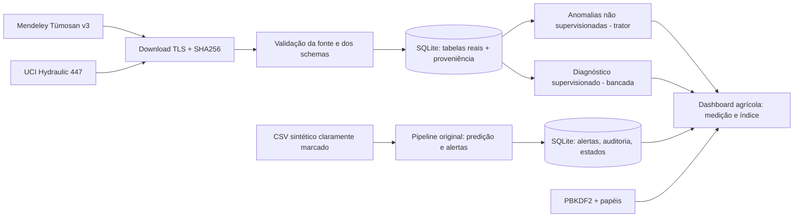

# SOMPO Agro Risk Intelligence | Sprint 4 | Grupo 58

**Autor:** Pedro Gomes12  
**RM:** 571446  
**Curso:** Tecnologia em Inteligência Artificial (On-Line), FIAP  
**E-mail institucional:** rm571446@fiap.com.br  
**Vídeo demonstrativo (link fornecido pelo autor):** https://youtu.be/wJ7WDSu_58Y  
**Repositório:** https://github.com/lapera555-ux/Sprint-4  
**Guia técnico integral:** `GUIA_PROFISSIONAL_SOMPO_AGRO.pdf` na raiz do pacote.  

> **Privacidade:** o CPF do autor não é necessário para a execução, reprodução ou correção técnica e não integra o repositório ou o PDF distribuído. Não versionar senha, banco com usuários locais nem tokens.  
> **Acesso ao repositório:** foi observado como público em 28/09/2026. O enunciado da Sprint 4 solicita repositório privado e acesso para `fiap-tutoria`; ajuste a visibilidade e as permissões antes da entrega, caso ainda aplicável.  
> **Vídeo:** URL inserida conforme informada pelo autor, sem atestar reprodução, duração ou configuração não listada.


**MVP acadêmico de monitoramento preventivo de máquinas agrícolas.** Este repositório é uma evolução do protótipo anterior (`src/`, SQLite, Streamlit, classificação experimental sintética, alertas, RBAC, auditoria e testes). A identidade SOMPO designa o desafio acadêmico; **não é um serviço oficial da seguradora**.

> **Transparência em primeiro lugar:** as medições originais enviadas pelo usuário **estão incluídas neste ZIP** e já foram importadas em um banco SQLite portátil. Consulte `docs/AGRO_FONTES_REAIS.md`, os manifestos e o guia PDF para contagens, hashes e execução. O download manual fornece integridade local, não checksum publicado pela Mendeley. A base legada `data/sompo_reproducible.db` e `data/demo_readings.csv` são inteiramente **sintéticas** e ficam visualmente marcadas. Não foram obtidos dados de telemetria, sinistros ou apólices da SOMPO.

## Interface didática ampliada

**O painel agora abre em “Comece aqui”** e explica, na própria tela, os conceitos de medição, janela, anomalia, classificação e investigação. Possui descrições junto aos cartões, gráficos e resultados; seleção de uma janela/ciclo para interpretação individual; matriz de confusão explicada; procedência em detalhe; glossário de sinais/termos e separação explícita da demonstração sintética. Consulte o guia PDF na raiz para interpretação de dados, arquitetura e limitações científicas. O banco e os artefatos científicos existentes foram preservados.

## 1. O problema e o alcance

Monitorar condições observadas e apoiar a prevenção de incidentes na operação de tratores e equipamentos agrícolas. A interface separa três evidências:

| Módulo | Origem | O que pode concluir | O que **não** conclui |
|---|---|---|---|
| Trator agrícola | Tümosan 81.110, CAN bus medido em 10 áreas de preparo do solo, Turquia | tendências reais por arquivo e índice estatístico de anomalia | falha futura, risco calibrado de tombamento, chance de sinistro |
| Diagnóstico hidráulico | UCI 447, medições em bancada real com condição controlada da bomba | classificador de vazamento no equipamento experimental, métricas calculadas | desempenho comprovado em tratores, máquinas da SOMPO ou apólices |
| Demonstração integrada | CSV e banco **simulados**, repositório legado | fluxo de importação → limpeza → score experimental → alerta → tratamento → relatório → trilha | validação em produção, frequência de falhas reais |
| INMET (referência externa) | base meteorológica pública | possível extensão futura com estação/período georreferenciados | nenhum dado meteorológico foi fundido com dados de tratores estrangeiros |

A simulação conserva o fluxo completo exigido, sem declarar seu score como probabilidade de sinistro. Dados reais ficam em tabelas, modelos e telas independentes. Usuários e logs são locais. Não utilizar este MVP para decisões reais de manutenção ou seguro.

## 2. Instalação e execução local

Pré-requisitos: **Python 3.13 recomendado**, conexão à internet apenas para instalar as dependências Python e espaço em disco para descompactar. Os arquivos científicos originais já estão incluídos. Banco local **SQLite** (o SQL fornecido não é PostgreSQL); escolhê-lo evita dependência externa e preserva o protótipo das Sprints anteriores.

**Atalho Windows da versão completa:** execute `ABRIR_SOMPO_WINDOWS.bat` na raiz do ZIP extraído. Para preservar o usuário da versão antiga, use `ATUALIZAR_NO_SEU_COMPUTADOR.bat` (cria backup e integra os dados enviados).

### Windows (PowerShell)
```powershell
py -m venv .venv
.\.venv\Scripts\Activate.ps1
python -m pip install -r requirements.txt
python -m scripts.quickstart
python -m pytest tests -q
python -m scripts.check_db
python -m scripts.check_agro
python -m streamlit run app.py
```
### Linux/macOS
```bash
python3 -m venv .venv
source .venv/bin/activate
python -m pip install -r requirements.txt
python -m scripts.quickstart
python -m pytest tests -q
python -m scripts.check_db
python -m scripts.check_agro
python -m streamlit run app.py
```
`quickstart` copia o banco demonstrativo para `data/sompo_local.db`, mantém o banco base intacto, verifica artefato/métricas e solicita senha admin (12–256 caracteres). O usuário é `admin`. Não envie senha, banco local ou `.env` para GitHub. Na ausência de Streamlit, o teste automatizado de sua UI é ignorado; instalar requirements é obrigatório na máquina de demonstração.

### Importar dados científicos com a rotina corrigida

No Windows, execute **`CONCLUIR_AGRO_WINDOWS.bat`**. O projeto preserva as importações e os modelos existentes; para atualizar uma instalação anterior, use o atalho `ATUALIZAR_NO_SEU_COMPUTADOR.bat` disponível na raiz do novo pacote. A API Mendeley pode exigir autenticação; nesse caso, a rotina abre a página oficial no Chrome e pede que você selecione o ZIP original pelo explorador de arquivos. Para quem já tem o arquivo:

```powershell
.\.venv\Scripts\python.exe -m scripts.concluir_agro --tractor-zip "C:\CAMINHO\ARQUIVO_ORIGINAL.zip" --non-interactive
.\.venv\Scripts\python.exe -m scripts.check_agro_final
```

Os comandos legados `scripts.setup_agro_real --dataset tractor` e `--official-zip` não fazem autenticação por navegador. Utilize a rotina nova. Ela exige dez arquivos `.tab`, reconciliação de 889.255 medições, 2.205 ciclos na hidráulica, hashes locais, modelos e rastreabilidade. Uma descarga manual preserva o ZIP original e registra **procedência declarada pelo usuário**, não SHA-256 do editor. A auditoria sinaliza `PASS_WITH_DECLARED_SOURCE` quando toda a operação é válida e resta essa limitação de autenticidade criptográfica. Se faltar arquivo ou houver divergência, informa `PENDING_OR_FAILED` e não declara êxito. Consulte o guia PDF e execute `VALIDAR_SOMPO_WINDOWS.bat`.

O projeto não baixa dados oficiais por meios não autorizados e não armazena senhas ou cookies da Mendeley. Nem o conjunto agrícola nem o hidráulico são telemetria ou sinistros fornecidos pela SOMPO.

## 3. Interface e perfis

Na barra lateral: **Comece aqui**, **Fontes e qualidade**, **Trator agrícola real**, **Diagnóstico hidráulico real**, **Investigações agrícolas**, **Guia: o que significa?**. As páginas **Visão geral, Importar CSV, Alertas, Tendências e Rastreabilidade** são explicitamente marcadas como **demonstração sintética**. O módulo hidráulico mostra a distribuição real das classes e resultados de teste, apenas quando foram calculados. O trator mostra nomes originais dos sensores, tendências de medições e índice de anomalia, nunca uma probabilidade de acidente.

`admin` gerencia contas, `operator` ingere e trata alertas, `analyst` consulta e audita. Cada ação na central de alertas deixa histórico; alertas originais não são alterados. O fluxo completo está em `src/ingestion.py`, `src/alert_workflow.py`, `src/security.py`, `src/agro_ui.py`.

## 4. Modelagem e decisões

- **Real trator:** `IsolationForest` sobre médias das variáveis numéricas comuns às janelas originais. Treino nas primeiras 70% das janelas de cada área; índice 0–100 é percentil empírico de incomum no treino, não probabilidade. Limiar P98 arbitrário e documentado. Sem verdade-terreno de falha, **não há precision/recall válidos para sinistros**. Código: `scripts/train_tractor.py`.
- **Real hidráulico:** as 2.205 linhas são ciclos experimentais; alvo `pump_leakage > 0` do `profile.txt`. Cada sensor vira média/desvio/mínimo/máximo por ciclo; grupos consecutivos de 25 ciclos são mantidos separados em treino/validação/teste. Dummy, logística e Random Forest são comparados **somente na validação**; limiar definido na validação e métricas medidas em teste retido. Código: `scripts/import_hydraulic.py`, `scripts/train_hydraulic.py`.
- **Simulado legado:** modelo e calibração já existentes, com sidecar e hash. A avaliação sintética não é transferível para as bases reais.

Métricas calculadas sobre os arquivos fornecidos estão em `models/*metrics.json` e no banco; os resultados não são extrapolados para sinistros. A auditoria automática está em `evidence/execucao_local`. A falta de rótulos de falha no trator impede afirmar previsão temporal de acidente.

## 5. Arquitetura e dados


Migrações `001–008` aplicadas por `src/database.initialize()`. `006_agro_real.sql` guarda medições agregadas imutáveis e classes originais; `007_agro_anomalies.sql` guarda versões e índices derivados; `008_agro_investigations.sql` cria fila de revisão humana, atribuição, versão de concorrência e histórico imutável. Chaves estrangeiras, unicidade de importação por SHA, eventos append-only e transações SQLite. O SQLite é a implementação entregue; `docs/sql_contract.md` oferece o contrato para integração com outro chat SQL.

## 6. Validação, evidências e autoavaliação

```bash
python -m pytest tests -q
python -m scripts.check_db
python -m scripts.check_agro
```
`evidence/agro_pytest.txt` e `evidence/agro_check_clean.txt` registram a execução do código neste pacote; `evidence/*_measured_run.json` só surgirão quando o download/import/treino reais terminarem. A validação de rede não pôde ser feita no ambiente de construção. `docs/AUTOAVALIACAO.md` distingue implementado, testado, pendente e limitações. Capturas reais e vídeo não foram criados por solicitação do aluno.

## 7. Documentos de entrega

- `docs/architecture.md` — arquitetura real e evolução do protótipo.
- `docs/AGRO_FONTES_REAIS.md` — fontes, DOIs, limites, licenças e explicação.
- `docs/MATRIZ_REQUISITOS.md` — rastreabilidade dos critérios da Sprint 4.
- `docs/user_stories.md` — histórias observáveis e necessidade de confrontar Sprint 1.
- `docs/security.md` — ameaças, perfis e limitações.
- `docs/model_evaluation.md` — metodologias e métricas sem números inventados.
- `GUIA_PROFISSIONAL_SOMPO_AGRO.pdf` — atividades externas.
- `docs/AUTOAVALIACAO.md` — avaliação crítica.
- `docs/sql_contract.md` — acordo com o chat SQL.

**Histórico:** a Sprint 4 consolida o MVP anterior; o ZIP recebido não contém entregas originais 1–3, portanto a continuidade histórica precisa ser conferida com os documentos/commits do grupo. Não declare esse alinhamento como já comprovado.

### Vídeo de até 5 minutos (narração humana)
**Link: [INSERIR URL REAL NÃO LISTADA DO YOUTUBE PELO GRUPO].** Não alterar depois do prazo sem orientação da FIAP. O aluno fará a gravação e a publicação.

### Repositório
Privado, compartilhado somente com integrantes autorizados e perfil `fiap-tutoria`; confirmar convite. Responsabilidade do grupo. Entregar antes de **28/09/2026 23h59**.

## 8. Citação das fontes reais

Dana, A. (2026). *TUMOSAN 81.110 POWERSHUTTLE SOIL TILLAGE OPERATIONS KONYA/TURKEY*, v3. Mendeley Data. https://doi.org/10.17632/bbjtjrsxvx.3 (CC BY 4.0).

Helwig, N., Pignanelli, E., & Schütze, A. (2015). *Condition monitoring of hydraulic systems*. UCI Machine Learning Repository. https://doi.org/10.24432/C5CW21 (CC BY 4.0).

**Toda medição real permanece vinculada à fonte de origem; são bases independentes, não dados de uma única máquina ou da seguradora.**


## Verificação definitiva do SQL e dos dados reais (migração 009)
`python -m scripts.quickstart` aplica as migrações 001–009 automaticamente. A 009 instala quatro views de reconciliação e linhagem usadas nas páginas agrícolas.
`python -m scripts.check_agro_final --structural-only` inspeciona estrutura sem alegar ter importado dados reais.
Após baixar e treinar **ambas** as fontes pela rotina `python -m scripts.concluir_agro`, rode `python -m scripts.check_agro_final`. O retorno `PASS` ou `PASS_WITH_DECLARED_SOURCE` exige os 10 arquivos originais do trator, o arquivo UCI, hashes correspondentes, 889255 leituras, 2205 ciclos e linhagem de scores. Resultado `PENDING_OR_FAILED` tem exit code 2. Não substitua registros originais por amostras fabricadas nem publique a senha/DB pessoal. Os arquivos científicos não acompanham este pacote.
As quatro views SQL também estão em `sql/agro_reporting_views.sql` e são instaladas somente via migração; não execute manualmente o `schema_final_consolidado.sql` num banco existente.

## Atualização operacional final para Windows (acesso Mendeley 401)

O pacote distribuído possui um atalho na **raiz**: `ATUALIZAR_NO_SEU_COMPUTADOR.bat`. Ele permite selecionar a pasta do projeto anterior no Windows, faz backup SQLite e preserva `data`, modelos, relatórios e ambiente virtual. Se esta for a primeira instalação, abra `sompo_mvp/CONCLUIR_AGRO_WINDOWS.bat` diretamente.

A API oficial da Mendeley exige autenticação para downloads. O atalho abre a página do editor e permite escolher o ZIP oficial baixado no navegador, sem solicitar tokens ou ignorar o bloqueio HTTP 401. A auditoria classifica a via manual como procedência declarada pelo usuário, com verificação de integridade local. Veja [guia sem erros](docs/COMO_EXECUTAR_SEM_ERROS.md). O comando antigo `setup_agro_real --dataset tractor` não faz fallback interativo; use `scripts.concluir_agro`.


## Entrega integrada após recebimento dos arquivos científicos

As duas bases científicas estão presentes, importadas e com modelos executados. Veja `README_DADOS_REAIS_E_EXECUCAO.md` e `evidence/execucao_local`. A importação de MetroPT e Scania permanece fora do escopo científico principal desta versão agro; suas tabelas auxiliares vazias não indicam falha dos módulos Tümosan e UCI hidráulica.

## Evidências e condições de interpretação

Os resultados agrícolas e hidráulicos são experimentos separados. O índice agrícola não é probabilidade de defeito ou de sinistro. O classificador hidráulico reconhece o alvo experimental de bancada; não foi validado como diagnóstico de trator segurado. O ZIP original e os hashes locais são preservados. A fonte Mendeley foi declarada pelo usuário; o checksum editorial independente não foi autenticado.
